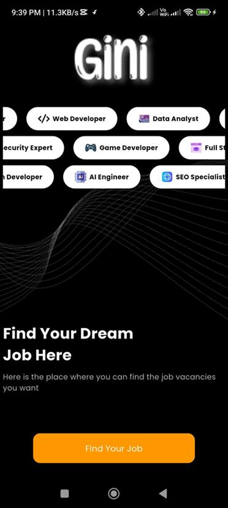
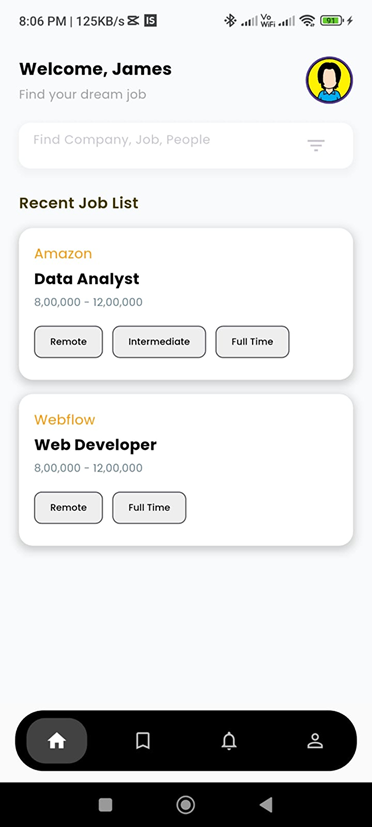
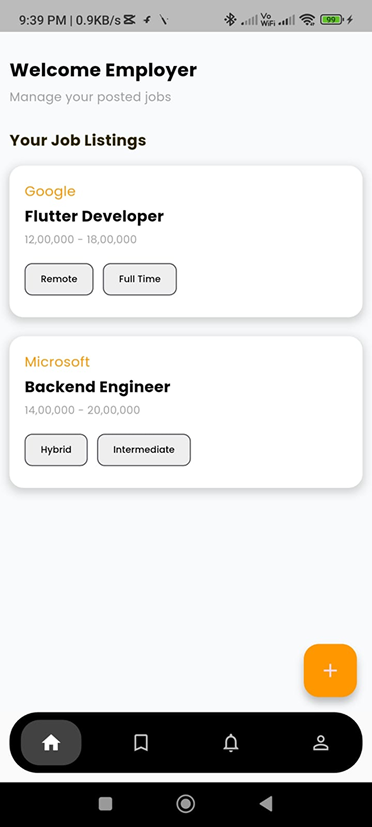

# 🚀 GINI – Your Personal Job Finder

**Gini** is a beautifully crafted Flutter application that helps users discover their dream jobs. It features Firebase Authentication, animated onboarding, and a sleek UI with modern scroll effects.

---

## ✨ Features

- 🔐 Firebase Email & Password Authentication
- 🎨 Custom fonts (Poppins)
- 🎞 Animated splash and onboarding screen
- 🔄 Horizontal marquee scroll for job categories
- 🧭 Slide transitions between pages
- 📱 Fully responsive and dark-themed UI

---
*the app is under development and still work in progress

##Future updates
🔍 Job search engine with filter & sort options
🌍 Location-based job recommendations using Maps API
📝 Resume upload & builder functionality
🧑‍💼 Recruiter dashboard for posting jobs
📥 Push notifications for job matches and messages
🕵️‍♂️ AI-based job matching and suggestion system
📊 Application tracking and progress dashboard
💬 In-app messaging between recruiters and job seekers
🗂 Saved jobs and user-specific preferences
🎯 Multi-language support for regional accessibility

## 📸 Screenshots

<p float="left">
  
  
  
  
</p>


---

## 📦 APK Download

Click below to download the latest APK of GINI:

[⬇️ Download APK](https://drive.google.com/drive/folders/15u7GD-9kI-0trc8QkCqMnDwweroNbSo5?usp=sharing)


---

## 🛠 Installation & Setup

### 🔧 Requirements

- Flutter 3.10+
- Dart SDK
- Firebase Project

### 🧩 Clone and Run

```bash
git clone https://github.com/yourusername/gini.git
cd gini
flutter pub get
flutter run
